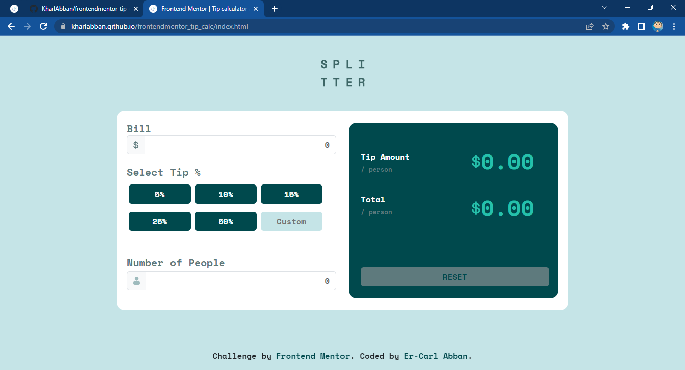

# Frontend Mentor - Tip calculator app solution

This is a solution to the [Tip calculator app challenge on Frontend Mentor](https://www.frontendmentor.io/challenges/tip-calculator-app-ugJNGbJUX). Frontend Mentor challenges help you improve your coding skills by building realistic projects.

## Table of contents

- [Overview](#overview)
  - [The challenge](#the-challenge)
  - [Screenshot](#screenshot)
  - [Links](#links)
- [My process](#my-process)
  - [Built with](#built-with)
  - [What I learned](#what-i-learned)
  - [Continued development](#continued-development)
  - [Useful resources](#useful-resources)
- [Author](#author)
- [Acknowledgments](#acknowledgments)

## Overview

### The challenge

Users should be able to:

- View the optimal layout for the app depending on their device's screen size
- See hover states for all interactive elements on the page
- Calculate the correct tip and total cost of the bill per person

### Screenshot

### Links

- Solution URL: [GitHub](https://github.com/KharlAbban/frontendmentor-tip-calc-app-soln)
- Live Site URL: [GitHub Pages](https://kharlabban.github.io/frontendmentor_tip_calc/index.html)

## My process

### Built with

- Semantic HTML5 markup
- CSS custom properties
- Flexbox
- CSS Grid
- Vanilla JS
- Mobile-first workflow
- [Bootstrap 5](https://getbootstrap.com) - CSS Framework

### What I learned
Dynamic thinking!

### Continued development

Reduce and simplify my sccript. I used many repititive statements. I'll focus on efficiently achieving the task.

### Useful resources

- [Bootstrap 5](https://www.getbootstrap.com) - This CSS framework is amazing. It virtually does all the styling and grid work for you. Check it out!
- [W3Schools](https://www.w3schools.com) - This is an amazing article which helped me throughout with helpful CSS tips, best practices, and examples.
- [Google Fonts](https://fonts.google.com) - This font collection really helped me spped up my workflow. I simply copied the @import code generated and I was good to go.
- [Stack Overflow](https://stackoverflow.com) - This is a very helpful technical and developer solution base. I found a lot of the answers to my issues here.
- [Web Dev Simplified](https://www.youtube.com/WebDevSimplified) - This channel has been a great learning source for all my frontend works. Do check him out!

## Author

- Frontend Mentor - [@KharlAbban](https://www.frontendmentor.io/profile/KharlAbban)
- Github - [KharlAbban](https://www.github.com/KharlAbban)
- LinkedIn - [KharlAbban](https://www.linkedin.com/in/er-carl-abban-623817271/)
